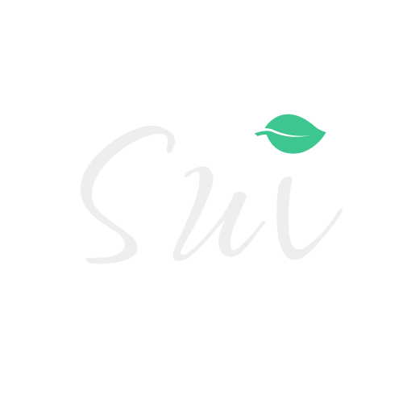

  <a href="https://sustainableui.com">
    <picture>
      <source media="(prefers-color-scheme: dark)" srcset=".github/assets/sui-logo-light.png">
      <source media="(prefers-color-scheme: light)" srcset=".github/assets/sui-logo-dark.png">
      
    </picture>
  </a>

  The Most Innovative project at <a href="https://taikai.network/gsf/hackathons/carbonhack22/projects/cl8j1ex3h2845301s653mtnk87/idea">Carbon Hack 22</a>, currently <a href="https://github.com/sustainableui/sui-headless-react/tree/develop">under heavy development</a>

------

